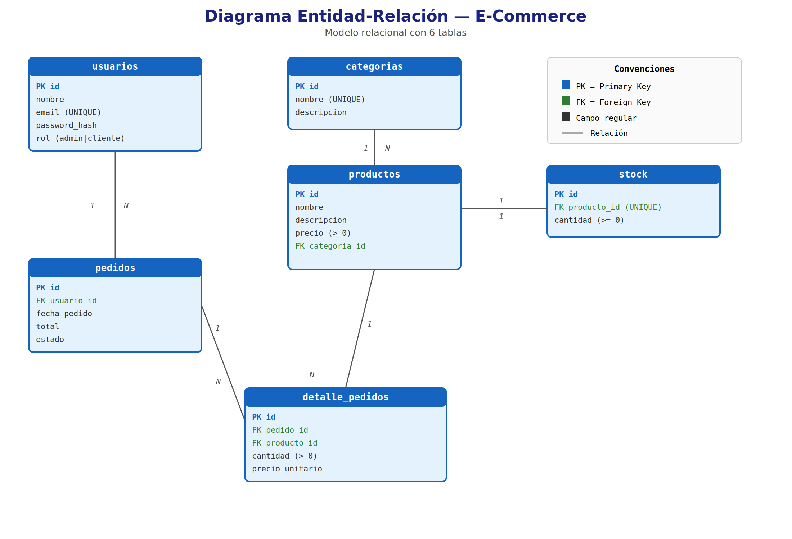

# Base de Datos Relacional — E-Commerce

Sistema de base de datos relacional para un e-commerce, diseñado para gestionar
usuarios, productos, categorías, pedidos, detalle de pedidos y stock de productos.

## Modelo de datos (ER)



### Tablas

| Tabla | Descripción |
|-------|-------------|
| `usuarios` | Clientes y administradores de la tienda |
| `categorias` | Clasificación de productos |
| `productos` | Catálogo de productos con precio |
| `stock` | Inventario disponible por producto (relación 1:1) |
| `pedidos` | Órdenes de compra realizadas por usuarios |
| `detalle_pedidos` | Productos incluidos en cada pedido |

## Requisitos

- Docker y Docker Compose

## Orden de ejecución

Los scripts SQL se ejecutan automáticamente al levantar los contenedores,
en el orden definido en `docker-compose.yml`:

1. **`schema.sql`** — Creación de tablas, PKs, FKs y restricciones
2. **`seed.sql`** — Carga de datos de ejemplo

Para ejecutar manualmente:

```bash
# Opción 1: Usando Docker (recomendado)
docker compose up -d

# Opción 2: Con psql directo
psql -U admin -d ecommerce -f schema.sql
psql -U admin -d ecommerce -f seed.sql
psql -U admin -d ecommerce -f queries.sql
psql -U admin -d ecommerce -f transaction.sql
```

También puedes ejecutar los scripts desde **pgAdmin**:
1. Abrir http://localhost:5050
2. Email: `admin@tienda.com` — Password: `admin123`
3. Registrar servidor: host `postgres`, puerto `5432`, user `admin`, pass `admin123`
4. Abrir Query Tool y ejecutar los scripts `.sql`

## Archivos

| Archivo | Contenido |
|---------|-----------|
| `docker-compose.yml` | Servicios PostgreSQL 16 + pgAdmin 4 |
| `schema.sql` | Definición de tablas con PKs, FKs, CHECK, UNIQUE |
| `seed.sql` | 3 categorías, 11 productos, 5 usuarios, stock, 3 pedidos |
| `queries.sql` | 6 consultas de negocio (listar, buscar, filtrar, totales, stock bajo) |
| `transaction.sql` | Registro transaccional de compra con control de stock |
| `er-diagram.png` | Diagrama entidad-relación |

## Evidencia de consultas

### 1. Productos con su categoría

```sql
SELECT p.id, p.nombre, p.precio, c.nombre AS categoria
FROM productos p
JOIN categorias c ON p.categoria_id = c.id
ORDER BY c.nombre, p.nombre;
```

| id | nombre | precio | categoria |
|----|--------|--------|-----------|
| 1 | Smartphone XYZ | 599.99 | Electrónica |
| 2 | Laptop Pro | 1299.99 | Electrónica |
| ... | ... | ... | ... |

### 2. Productos con stock bajo (< 5)

```sql
SELECT p.id, p.nombre, s.cantidad
FROM stock s
JOIN productos p ON s.producto_id = p.id
WHERE s.cantidad < 5;
```

| id | nombre | cantidad |
|----|--------|----------|
| 9 | Lámpara LED | 4 |
| 10 | Silla Ergonómica | 3 |

### 3. Total de un pedido

```sql
SELECT pe.id AS pedido_id, u.nombre AS cliente,
       SUM(dp.cantidad * dp.precio_unitario) AS total
FROM pedidos pe
JOIN usuarios u ON pe.usuario_id = u.id
JOIN detalle_pedidos dp ON dp.pedido_id = pe.id
WHERE pe.id = 2
GROUP BY pe.id, u.nombre;
```

| pedido_id | cliente | total |
|-----------|---------|-------|
| 2 | María García | 164.95 |

## Transacción de compra

La transacción (`transaction.sql`) realiza:

1. Valida stock suficiente para cada producto
2. Crea el pedido con estado `pendiente`
3. Inserta los detalles del pedido
4. Descuenta del stock correspondiente
5. Actualiza el total y cambia estado a `completado`
6. Si hay error (stock insuficiente), revierte todo (ROLLBACK)


# enlance git https://github.com/kandylorena/Modulo5-base-de-datos-relacionales.git